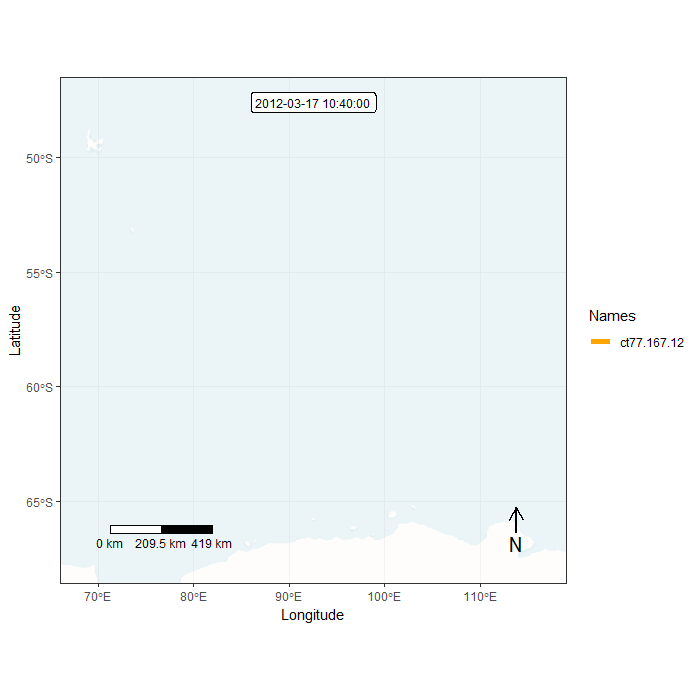
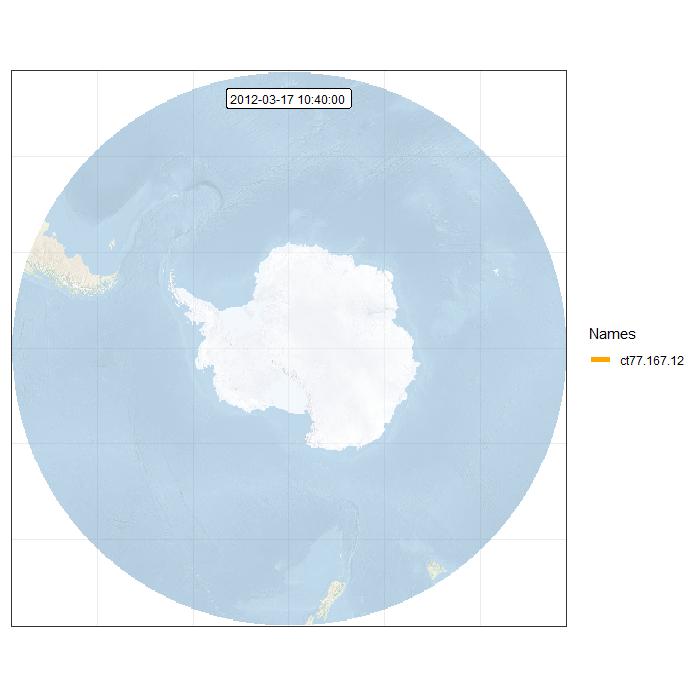

```{r setup, include=FALSE}
knitr::opts_chunk$set(echo = TRUE)
```

# Animal oceanographers

## Import spatial data from .csv files

One of the core components of R are `data.frame` objects. You can turn tabular text files, spreadsheets and databases into `data.frame` objects. Having spatial coordinates in your `data.frame` will allow you to easily turn it into a spatial object.

In this example we will import a dataset of CTD (conductivity, temperature, depth) profiles from oceanographic sensors that were equipped on Southern Elephant Seals. This is a subset of the [MEOP-CTD in-situ data collection](https://doi.org/10.17882/45461).

```{r}
# subset of Mirounga leonina for 2012
mirounga <- read.csv("data/meop/miorunga.csv")
class(mirounga)
head(mirounga)
```

Transform the `data.frame` into a `sp` class object:

```{r message = FALSE, warning = FALSE}
library(rgdal)

coordinates(mirounga) <- ~lon+lat
proj4string(mirounga)  # displays the coordinate reference system (CRS)
```

We need to set the CRS of the spatial layer:

```{r}
# use EPSG code
proj4string(mirounga) <- CRS("+init=epsg:4326")

# alternative using proj4 string
# proj4string(mirounga) <- CRS("+proj=longlat +datum=WGS84 +no_defs +ellps=WGS84 +towgs84=0,0,0")
```

Using EPSG codes can be more convenient that using larger strings. You can find more about EPSG codes at the [Spatial Reference website](https://spatialreference.org/). 

We can now plot the data to see how it looks:

```{r}
plot(mirounga)
```

As with the previous practical, adding some layers to give context to the data would be ideal:

```{r}
countries <- readOGR(dsn = "data/ne/ne_110m_admin_0_countries", layer = "ne_110m_admin_0_countries")
plot(countries, col = "grey80", border = "grey80", axes = TRUE)
plot(mirounga, pch = 20, add = TRUE)
```

## Advanced maps with `ggplot2`

In this example we will use `ggplot2` to display the CTD data. Due to the high density, we will bin data into regular cells to summarize the observations. Finally, we will also explore how to change the CRS of the plot into a polar projection:

```{r message = FALSE, warning = FALSE}
library(ggplot2)
library(viridis)

# country layer have some issues using orthographic projection
world <- map_data("world")  # turn data from the maps package in to a data frame suitable for plotting with ggplot2

# also turn back the CTD dataset into a data.frame
mirounga_df <- data.frame(mirounga)

ggplot() + 
  geom_bin2d(data = mirounga_df, aes(x = lon, y = lat), bins = 100) +
  geom_path(data = world, aes(x = long, y = lat, group = group), colour = "#c0c0c0") +
  ylim(-90, -30) +
  xlab("") + 
  ylab("") +
  coord_map("ortho", orientation = c(-90, 0, 0)) + # orthographic projection from South Pole
  scale_fill_viridis(option = "viridis", trans = "log") + # log scale for bin count
  theme(panel.background = element_rect("white"), # dark background
        axis.ticks = element_blank(),
        panel.grid = element_blank(), # remove panel grid
        axis.text = element_blank()) # remove x-axis value
```

## Movement trajectory data

??ADD A BIT OF INTRO??

```{r}
# Select one tag
track <- mirounga[mirounga$tag == "ct77-167-12",]
plot(track, axes = TRUE)
plot(countries, col = "grey80", border = "grey80", add=TRUE)
```

## Convex hull polygon

Creating a convex hull around a set of points is another common GIS operation. This essentially creates the smallest polygon possible that can contain a given set of points. Variations in the parameters determining the characteristics of the polygon can also be applied, but for this example we will use the default settings. In R, this can be created with one line of code, utilising the `mcp` function:

```{r message = FALSE, warning = FALSE}
library(adehabitatHR)

hull <- mcp(track, percent = 100)
plot(hull, col = "lightblue")
plot(track,add=TRUE)
plot(countries, col = "grey80", border = "grey80", add=TRUE)
```

## Export new objects

Finally, we can export this new `sp` object into a shapefile, geopackage or KML in order to be imported into a GIS software like QGIS:

```{r message = FALSE, warning = FALSE}
# export to shapefile
writeOGR(track, dsn = "data/meop", layer = "track_points", driver = "ESRI Shapefile", overwrite_layer = TRUE)
writeOGR(hull, dsn = "data/meop", layer = "track_hull", driver = "ESRI Shapefile", overwrite_layer = TRUE)

# export to geopackage
writeOGR(track, dsn = "data/meop", layer = "track_points", driver = "GPKG", overwrite_layer = TRUE)
writeOGR(hull, dsn = "data/meop", layer = "track_hull", driver = "GPKG", overwrite_layer = TRUE)

# export to KML
writeOGR(track, dsn = "data/meop/track_points.kml", layer = "track", driver = "KML", overwrite_layer = TRUE)
writeOGR(hull, dsn = "data/meop/track_hull.kml", layer = "hull", driver = "ESRI Shapefile", overwrite_layer = TRUE)
```

## Animated plots for movement data

```{r message = FALSE, warning = FALSE}
library(lubridate)  # parse times
library(move)  # move object class and tools for trajectories
library(moveVis)  # animation plots
```

First, we will convert the trajectory data into a move object:

```{r}
# back transform SpatialPointsDataFrame into a data.frame
track <- as.data.frame(track)

# parse date time
track$date <- parse_date_time(track$date, "Ymd HMS")

# convert to move object
mdata <- move(x=track$lon, y=track$lat, time=track$date, 
                  data=track, proj=CRS("+proj=longlat +ellps=WGS84"), 
                  animal=track$tag)
```

Trajectories from animals or humans can be recorded at irregular sampling intervals. To explore data using animations, we need to generate unique time frames. Therefore, we have to interpolate the trajectory at regular time intervals:

```{r}
# align move_data to a uniform time scale
# for animation, unique frame times are needed 
m <- align_move(mdata, res = 1, digit = 0, unit = "days", spaceMethod = "greatcircle")
```

The next step is to create individual frames for each time step:

```{r message = FALSE}
# create spatial frames with an OpenStreetMap watercolour map
frames <- frames_spatial(m,  # move object
                         map_service = "carto", map_type = "voyager_no_labels",  # base map
                         path_size = 2, path_colours = c("orange"), alpha = 0.5) %>%  # path
          add_labels(x = "Longitude", y = "Latitude") %>% # add some customizations
          add_northarrow(colour = "black", position = "bottomright") %>% 
          add_scalebar(colour = "black", position = "bottomleft") %>% 
          add_timestamps(m, type = "label") %>% 
          add_progress(size = 2)
```

We can preview one of the frames:

```{r}
frames[[100]]
```

Finally, we can generate an animation by combining all individual frames. This function takes a while...

```{r eval = FALSE}
animate_frames(frames, out_file = "img/animation.gif", overwrite = TRUE, display = FALSE)
```



### Extra bonus material

We will combine our previous knowledge to transform data into a polar projection. And will use a custom base maps in raster format:

```{r}
# transform trajectory to the polar stereographic projection (EPSG:3031)
mpol <- spTransform(m, crs("+init=epsg:3031"))

# import base map
bmap <- brick("data/ne/NE1_50M_SR_W/NE1_50M_SR_W.tif")

# plot base map raster
plot(bmap)

# compose the 3 RGB bands of Tif file
plotRGB(bmap)

# crop basedmap to extent of track (plus 2 degrees)
bmap <- crop(bmap, extent(-180, 180, -90, -40))

# reproject raster to polar stereographic projection (EPSG:3031)
bmap_pol <- projectRaster(bmap, crs = crs("+init=epsg:3031"))

# plot data
plotRGB(bmap_pol, addfun = lines(mpol))
```

Prepare individual frames for animation. Note this time there are several differences in the code:

```{r message = FALSE}
# create spatial frames with a custom basemap
frames <- frames_spatial(mpol,
          r_list = bmap_pol, r_times = m$time[1], ext = extent(bmap_pol),  #custom base map
          path_size = 2, path_colours = c("orange"), alpha = 0.5) %>% 
          add_timestamps(mpol, type = "label") %>% 
          add_progress(size = 2)

frames[[100]] # preview one of the frames, e.g. the 100th frame
```

This time, we will remove the axis labels:

```{r message = FALSE}
# remove axis
frames <- add_gg(frames, gg = expr(theme(axis.ticks = element_blank(),
                                         axis.title = element_blank(),
                                         axis.text = element_blank())))

frames[[100]] # preview one of the frames, e.g. the 100th frame
```

Finally, we can generate an animation by combining all individual frames. This function takes a while...

```{r eval = FALSE}
# animate frames
animate_frames(frames, out_file = "img/animation_polar.gif", overwrite = TRUE)
```


## Retrieve animal observations using R client for APIs

Several public online databases offer the posibility to extract their information using an application programming interface (API). An API is a set of routines, protocols, and tools for building software applications. There are some R packages that allow the connection to those APIs in order to retrieve information.

Here, we show the use of one client for the Ocean Biogeographic Information System that allow us to extract species occurrence records:

```{r message = FALSE, eval = FALSE}
library(robis)
records <- occurrence("Physeter macrocephalus")  # Scientific name of the sperm whale. You can replace it with your favourite one!
```