--- 
title: "Working with vector data"
author: "D March"
site: bookdown::bookdown_site
output:
    bookdown::gitbook:
        config:
            sharing: null
        css: 'style.css'
        includes:
            in_header: _toggle.html
        keep_md: TRUE
linkcolor: blue
documentclass: book
link-citations: yes
description: "Skeleton Tutorial Template"
---


# Working with vector data in R


In this module of the workshop we are going to work with vector data (points, lines and polygons). R has an extraordinary potential to handle this data and perform complex spatial operations like other Geographic Information Systems (GIS) software.

Here you will find a link to:
* Data. Download the zip file and store it into a `data/` folder from your Rstudio project.
* Slides.

We will explore the capacities of R to handle and manipulate vector data through two worked examples:

1. Hello, world!

2. Animal oceanographers

<!--chapter:end:index.Rmd-->

# Hello, world!


## Importing vector data


### Spatial data formats

The [Geospatial Data Abstraction Library](https://gdal.org/) is a translator library for raster and vector geospatial data formats. We will start by loading the R package of this library and check all the vector data formats that can be imported into R


```r
library(rgdal)
vector_formats <- ogrDrivers()
head(vector_formats)
```

```
##         name                     long_name write  copy isVector
## 1 AeronavFAA                   Aeronav FAA FALSE FALSE     TRUE
## 2 AmigoCloud                    AmigoCloud  TRUE FALSE     TRUE
## 3     ARCGEN             Arc/Info Generate FALSE FALSE     TRUE
## 4     AVCBin      Arc/Info Binary Coverage FALSE FALSE     TRUE
## 5     AVCE00 Arc/Info E00 (ASCII) Coverage FALSE FALSE     TRUE
## 6        BNA                     Atlas BNA  TRUE FALSE     TRUE
```

You can explore `vector_formats`. How many different formats are available? Are you familiar with any of them?


###  Import shapefiles

[shapefile](https://en.wikipedia.org/wiki/Shapefile) is a popular format used in GIS.
We will import a polygon layer of the world countries extracted from [Natural Earth](https://www.naturalearthdata.com/).


```r
# Import countries
countries <- readOGR(dsn = "data/ne/ne_110m_admin_0_countries", layer = "ne_110m_admin_0_countries")
```

```
## OGR data source with driver: ESRI Shapefile 
## Source: "C:\Git\spatial_data_analysis\data\ne\ne_110m_admin_0_countries", layer: "ne_110m_admin_0_countries"
## with 177 features
## It has 94 fields
## Integer64 fields read as strings:  POP_EST NE_ID
```

We can check the class and spatial attributes of this layer


```r
# View spatial attributes
class(countries)  # sp class
```

```
## [1] "SpatialPolygonsDataFrame"
## attr(,"package")
## [1] "sp"
```

And now, let's make our first plot using base R graphics


```r
# Quick plot
plot(countries, main = "World countries")
```

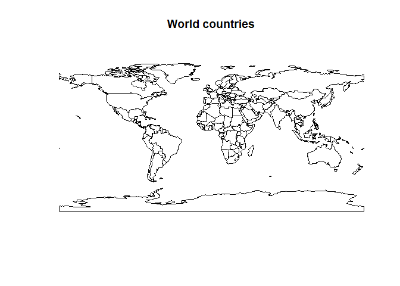<!-- -->


## Coordinate Reference Systems (CRS)

You can check the CRS from your spatial object


```r
# View spatial attributes
proj4string(countries)  # displays the coordinate reference system (CRS)
```

```
## [1] "+proj=longlat +datum=WGS84 +no_defs +ellps=WGS84 +towgs84=0,0,0"
```


And then transform to another CRS. In this case, we transform to the [Mollweide projection](https://en.wikipedia.org/wiki/Mollweide_projection). This is an accurate single global projection that preserves geographic area. You can see an example of application in [March et al. 2019](https://doi.org/10.1111/gcb.14902)


```r
# Change to Mollweide projection
countries_moll <- spTransform(countries, CRS("+proj=moll +ellps=WGS84"))

# Quick plot
plot(countries_moll, col = "grey80", main = "World countries")
```

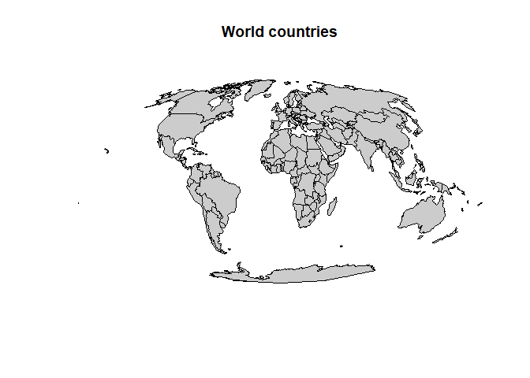<!-- -->


## Geographic subset


### Geographic subset by setting a bounding box

First, create a bounding area for subsetting the data


```r
# Import raster package
library(raster)

# Set min and maximum coordinates (lon/lat)
xmin <- -15
xmax <- 46
ymin <- 28
ymax <- 60

# Create an extent object
e <- extent(xmin, xmax, ymin, ymax)
class(e)
```

```
## [1] "Extent"
## attr(,"package")
## [1] "raster"
```

Then, you can use the `extent` object to subset the worl map using `crop()` function


```r
# Geographic subset of countries by the extent defined
countries_subset <- crop(countries, e)
plot(countries_subset)
```

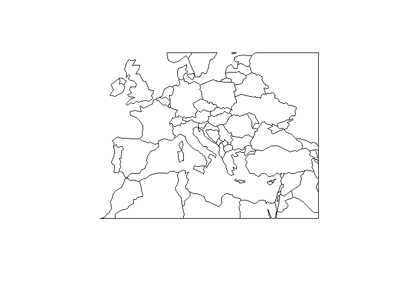<!-- -->


#### Exercise:
* Make a plot of South America
* Tip: you can Use QGIS or Google Earth to search for coordinates


### Geographic subset by data attributes

The spatial layer of polygons has a linked attribute table, with specific information for each country. You can explore convert the `@data` object from `countries` into a `data.frame` and then explore the attribute data.


```r
# Convert attribute data into a data.frame
df <- data.frame(countries@data)
# head(df)
```


List of continents


```r
unique(countries$CONTINENT)
```

```
## [1] Oceania                 Africa                  North America          
## [4] Asia                    South America           Europe                 
## [7] Seven seas (open ocean) Antarctica             
## 8 Levels: Africa Antarctica Asia Europe North America ... South America
```


Subset countries from South America


```r
# Subset South America
south_america <- countries[countries$CONTINENT == "South America",]
plot(south_america, col = "lightgreen", border = "darkgreen", lwd=3, main = "South America")
```

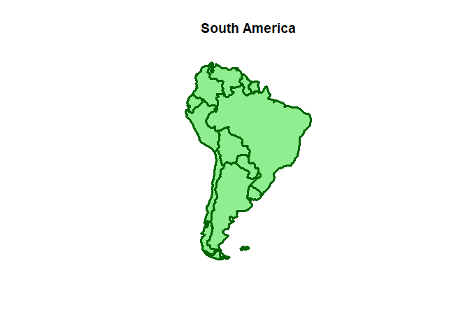<!-- -->

```r
extent(south_america)  # You can also get your extent
```

```
## class      : Extent 
## xmin       : -81.41094 
## xmax       : -34.72999 
## ymin       : -55.61183 
## ymax       : 12.4373
```


## Import vector layer: point data

We will import layer "Populated places of the world" from Natural Earth


```r
# Import populated places
places <- readOGR(dsn = "data/ne/ne_110m_populated_places_simple", layer = "ne_110m_populated_places_simple")
```

```
## OGR data source with driver: ESRI Shapefile 
## Source: "C:\Git\spatial_data_analysis\data\ne\ne_110m_populated_places_simple", layer: "ne_110m_populated_places_simple"
## with 243 features
## It has 38 fields
## Integer64 fields read as strings:  ne_id
```

```r
# View spatial attributes
class(places)
```

```
## [1] "SpatialPointsDataFrame"
## attr(,"package")
## [1] "sp"
```

```r
extent(places)
```

```
## class      : Extent 
## xmin       : -175.2206 
## xmax       : 179.2166 
## ymin       : -41.29999 
## ymax       : 64.15002
```

```r
crs(places)
```

```
## CRS arguments:
##  +proj=longlat +datum=WGS84 +no_defs +ellps=WGS84 +towgs84=0,0,0
```

```r
# Quick plot
plot(places, main = "Populated places")  
```

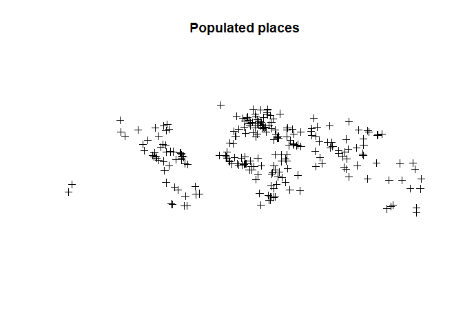<!-- -->

The plot is not very informative. Let's combine with the world map


```r
# Plot together with country maps
plot(countries, col = "grey80", border = "grey80")
plot(places, pch = 20, col = "darkblue", add = TRUE)
```

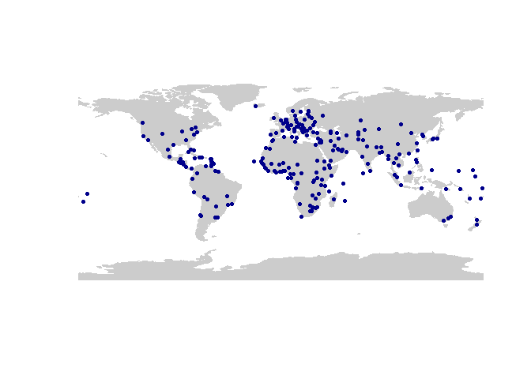<!-- -->


## Spatial overlap

The overlap between spatial layer in order to extract information from one to another is one of the most common tasks in GIS.

Here, we want to plot the populated places from Europe. However, there is no information about the continent in the places layer. We will use a spatial overlay to extract information from the countries layer using the function `over()`


```r
# Spatial overlay
ov <- over(places, countries)
class(ov)
```

```
## [1] "data.frame"
```

We then can append the continent information into the point layer


```r
places$CONTINENT <- ov$CONTINENT
# head(places)
```


Note that there are places with `NA` in the continent attribute. This is due to a spatial missmatch between layers in terms of resolution, more specifically because of the coarse resolution of the countries layer. There would be several alternatives: 1) use a high-res countries map, 2) calculate the nearest polygon.


```r
# Subset places and countries from Africa
places_africa <- places[which(places$CONTINENT == "Africa"),]

# Plot together with country maps
plot(countries, col = "grey80", border = "grey80")
plot(places_africa, pch = 20, col = "darkblue", add = TRUE)
```

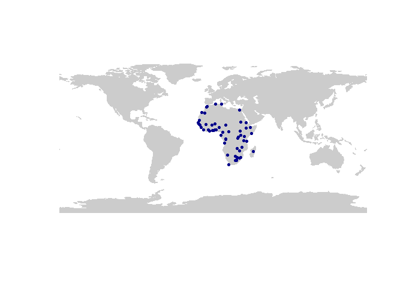<!-- -->


## Interactive maps

Spatial datasets oftern require to conduct an interative visualization of the data. In R, we can use the `leaflet` library to generate a dynamic viewer.


```r
# import leaflet package
library(leaflet)

# create leaftet map
map <- leaflet(data = places) %>%
  addProviderTiles("Esri.OceanBasemap") %>%  # Base map
  addMarkers(popup = ~name)

# plot leaflet map
map
```

<!--html_preserve--><div id="htmlwidget-e5315424cc6bee8d538d" style="width:672px;height:480px;" class="leaflet html-widget"></div>
<script type="application/json" data-for="htmlwidget-e5315424cc6bee8d538d">{"x":{"options":{"crs":{"crsClass":"L.CRS.EPSG3857","code":null,"proj4def":null,"projectedBounds":null,"options":{}}},"calls":[{"method":"addProviderTiles","args":["Esri.OceanBasemap",null,null,{"errorTileUrl":"","noWrap":false,"detectRetina":false}]},{"method":"addMarkers","args":[[41.9032821799601,43.936095834768,47.1337237742936,-26.4666674613525,49.6116603791211,6.91664369600772,7.10300431121624,-8.51665199904107,7.48739617297798,26.1191666859934,43.7396456878525,1.3381875056246,-11.7041576956685,42.5000014435459,10.6519970895773,-1.95164421006325,-26.3166507784092,4.82997519827796,52.0800368439749,46.0552883087945,48.1500183299617,25.2865560089066,42.4659725128817,6.90000388480962,16.4299906605639,-6.18330605176618,46.9166827586677,27.1499823191355,42.6667096141194,15.3010156442833,11.5950144642555,2.91401979462455,35.0319381468556,13.4538764603159,42.0000061229059,13.1020025827511,6.48331097302423,-3.37608722037464,13.1482788278684,14.0019734893303,17.3020304554894,-20.1666385713532,12.0526334017204,26.2361362904859,17.1180365183141,-34.8560957075907,6.13388293026838,36.8027781362314,24.4666835723799,37.949994933111,-15.4146984093359,-17.8158438357778,-8.55938840854645,-17.7333504040258,14.1039907590764,6.80197369275203,64.1500236197392,18.5429704547324,0.318604813383331,5.83503012992259,13.5186518105065,38.5600352163166,-25.2944571170577,12.1549624387561,8.47195727109818,33.7019418089596,27.7186377724772,-29.1199938773787,-25.7049746951844,-9.46470782586778,-9.4379942950896,8.96996304909487,34.0253073110728,47.0050236196706,-25.953331628779,2.06862719294753,23.6133248077281,6.93196575818212,47.9186192585607,-22.5700060843838,9.0852790077542,11.8650238229806,31.9519711058275,54.6833663117586,56.950023823161,42.8750253050901,-29.3166743786816,-18.9146914920321,-0.213042322035562,9.93695828835661,13.711947505494,17.9770766238309,12.1150423948106,3.75001527802618,15.3333392526819,45.8000067332725,59.4338773794859,-13.9832950654692,14.6230805214482,0.385388609718518,-18.1330159313712,-33.0458186079742,18.0864270212475,12.6519605263233,33.8739209756269,41.7269558470776,51.1811253042576,17.9666927276274,-4.25723991319751,9.53346870502179,6.81838096000462,45.4186426553604,44.8205913044467,4.88333111461924,-19.0409708467395,17.2520335072469,4.36664430634909,3.86864652075411,41.3275407094916,40.1830965941419,40.397217891343,11.5519759885584,-16.4960277550434,6.40195442278247,42.6852952839305,53.9019232950431,27.4729858591758,-24.6463134574389,-35.2830285453721,12.3722618365434,43.8500223989549,19.7685028847501,-21.1385123566986,9.56002239881775,-4.6166316539734,0.333402118832907,-13.8415450424484,35.8997324819309,4.1667081898118,31.7784078155733,14.9166980173287,25.0833901153512,35.1666764516545,-41.2999878536917,21.0352731077371,39.9291844440755,47.5019521849914,15.3566791542636,44.4353176634946,33.5019798542061,38.7246687364878,15.5900240842777,59.9186361450019,52.2519464883956,39.0213845580043,-6.79806673612438,53.3350069945849,6.31458164716014,3.16861173071237,23.1339046995422,50.0852828734783,29.3716634886296,18.4720187131954,5.55198046444593,32.8925000193537,32.0819373330417,60.1775092325681,55.6805100490259,5.32194282609856,-15.781394372879,50.8352629353303,23.7250055703128,-8.83634025501266,36.7650106566281,16.7852999631888,37.7691956296874,39.7411339069655,29.8219202431889,25.7895565550215,33.8319597126059,41.8319365192784,10.5029444130333,50.4353131876072,25.2319420123761,41.3136477416072,40.4019721231138,46.2100075470763,59.3527058128658,13.751945064088,-12.0460668175256,14.7177775836233,-26.1680988813841,52.3519145466644,33.6019220742585,37.5682949583889,14.6061048134405,25.6719409951253,52.5237645222512,43.8069580850418,30.6719458779578,34.7519810749142,-4.32777824327599,28.6000230092454,12.9719409950744,37.9852720905523,33.3405943561586,9.03525622129575,35.6738886270013,49.2753624427118,43.7019257364084,-34.6005557499074,34.5186361449003,48.2019611368169,-37.8180854536963,25.0358333333333,-36.848054894932,33.9919241087654,38.9014952350871,40.7519249225946,51.5019405883275,41.1069420124398,24.6427790078164,-33.9180651086288,55.7541099812482,19.4443883014155,6.44520751209319,41.8979014850989,39.9308380899091,-1.28140088323778,-6.17247184679889,4.59836942114782,30.0519062051037,31.2183983112283,35.6869627643712,19.0189362343566,48.8686387898146,-33.4480679569341,22.4969151568964,-22.923077315616,-23.556733728379,-33.9180651086288,1.29497932510594,22.3069267535755],[12.4533865449718,12.4417701578001,9.51666947290727,31.1999971097127,6.13000280622708,158.149974323762,171.380000175747,179.216647094029,134.626548466992,-9.65252221825011,7.40691317346506,173.017570828549,43.2402440986933,1.51648596050552,-61.5170308854497,30.0585859190641,31.1333345120564,31.5800255927873,4.26996130231345,14.5149690334741,17.1169807522346,51.5329678942993,19.2663069241182,79.9499930408975,120.569942585331,35.7500036201477,7.46697546248242,-13.2000059422227,21.1659842515999,-61.3870129818034,43.1480016670523,101.701946979786,135.74805206532,-16.5917014892126,21.4334614651425,-59.6165267350516,2.61662552756718,29.3600060615284,-61.2120624202793,-61.0000081803695,-62.7170093196993,57.4999938546097,-61.7416432260748,50.5830517159102,-61.8500338151387,-56.172998147036,1.22081126074562,10.179678099212,54.366593382592,58.3832991117746,28.2813817361143,31.0427635720628,125.579455931705,168.316640583569,-87.2194751979415,-58.1670286474806,-21.9500144871795,-72.3379804469055,32.581377667121,-55.1670308854244,2.11471018653037,68.7738793527017,-57.6434510279013,-86.2704375189012,-13.2361615990127,73.1646886210596,85.3146963522279,26.2299128811774,28.2274832172338,147.192503620594,159.949765733606,-79.5349830104108,-6.83640815612614,28.8577111396514,32.5872171039701,45.3647317524587,58.5933121326088,79.8577506092564,106.914669903747,17.0835461005418,7.53138214293233,-15.5983608413208,35.9313540668741,25.3166352932829,24.0999653714032,74.5832583639037,27.4832730699845,47.5146780415299,-78.5019969671124,-84.0859972112754,-89.2049870794599,-76.7674337136691,15.0472024554623,8.78327754582114,38.9333235257593,15.9999946682457,24.7280407294786,33.7833019599835,-90.5289114365615,9.4579650458237,178.44170731538,-71.6229594914989,-15.97534041489,-8.0019849632497,35.5077623513777,44.788849590998,71.427774209483,102.599980020155,15.2827436338487,-13.6821808861239,-5.2755025649123,-75.7019611598095,20.4660448220205,114.933284056662,-65.2595156266756,-88.7670729998165,18.5582881252873,11.5147048968544,19.8188830146152,44.5116055317521,49.8602713032578,104.914688621186,-68.1519310491022,2.5180447405686,23.3147081521101,27.5646812966583,89.63901403703,25.9119477932854,149.129026244299,-1.52666961491644,18.3830016669533,96.1166726706304,-175.220564477617,44.0653100166654,55.4499897855911,6.73332515323477,-171.738641608603,14.5147106513128,73.499947467955,35.2066259345987,-23.5166888849722,-77.3500437842761,33.3666348864141,174.783265859282,105.848068341242,32.8624457823566,19.0813748187597,44.2046475239384,26.0980007953504,36.2980500304171,-9.14681216410213,32.5322333800116,10.7480333473723,20.9980536924653,125.752744854994,39.2663959776946,-6.25085154039107,-10.7996604367759,101.698037416746,-82.3661280299533,14.4640339170485,47.9763552876253,-69.902030943315,-0.218661598960693,13.1800117580782,34.7680658995517,24.9321804828456,12.5615398887033,-4.04199411850709,-47.9179981470031,4.33137074969045,90.4066336081075,13.2324811826686,3.04860667090924,96.1647317526619,-122.417168773552,-104.985961810968,-95.341925149146,-80.22605193945,-84.4018952418756,-87.7520008327093,-66.9189830510504,30.5146821104722,55.2780284647379,69.2929869608878,-3.68529754461252,6.1400280340917,18.0953888741809,100.514698793695,-77.0520079534347,-17.4750759870506,28.0280638650195,4.91469431740097,-7.61831329169871,126.997785138202,120.980271303542,-100.33193064233,13.3996027647005,87.5730597962473,104.068073630949,135.458198956595,15.3130260231717,77.199980020053,77.5580638652175,23.7313752256794,44.3919229145641,38.6980585753487,51.422398175009,-123.123590076394,-79.4219666529884,-58.3994772323314,69.1813141907051,16.3646930967437,144.973070375904,121.568333333333,174.76302698708,-118.18192636994,-77.0113644394372,-73.9819627874068,-0.118667702475932,29.0080557270026,46.7707957986883,18.433042299226,37.6135769672714,-99.1329340602939,3.38958521259843,12.481312562874,116.386339825659,36.8147110004714,106.82749176247,-74.0852898137744,31.2480223611261,121.43455881982,139.749461570545,72.8550434387665,2.33138946713035,-70.6689867131748,88.3227297995055,-43.2269666528437,-46.6269658390552,151.183233950147,103.853874819099,114.183063458463],null,null,null,{"interactive":true,"draggable":false,"keyboard":true,"title":"","alt":"","zIndexOffset":0,"opacity":1,"riseOnHover":false,"riseOffset":250},["Vatican City","San Marino","Vaduz","Lobamba","Luxembourg","Palikir","Majuro","Funafuti","Melekeok","Bir Lehlou","Monaco","Tarawa","Moroni","Andorra","Port-of-Spain","Kigali","Mbabane","Juba","The Hague","Ljubljana","Bratislava","Doha","Podgorica","Sri Jawewardenepura Kotte","Baguio City","Dodoma","Bern","Laayoune","Pristina","Roseau","Djibouti","Putrajaya","Kyoto","Banjul","Skopje","Bridgetown","Porto-Novo","Bujumbura","Kingstown","Castries","Basseterre","Port Louis","Saint George's","Manama","Saint John's","Montevideo","Lomé","Tunis","Abu Dhabi","Ashgabat","Lusaka","Harare","Dili","Port Vila","Tegucigalpa","Georgetown","Reykjavík","Port-au-Prince","Kampala","Paramaribo","Niamey","Dushanbe","Asunción","Managua","Freetown","Islamabad","Kathmandu","Bloemfontein","Pretoria","Port Moresby","Honiara","Panama City","Rabat","Chișinău","Maputo","Mogadishu","Muscat","Colombo","Ulaanbaatar","Windhoek","Abuja","Bissau","Amman","Vilnius","Riga","Bishkek","Maseru","Antananarivo","Quito","San José","San Salvador","Kingston","Ndjamena","Malabo","Asmara","Zagreb","Tallinn","Lilongwe","Guatemala","Libreville","Suva","Valparaíso","Nouakchott","Bamako","Beirut","Tbilisi","Astana","Vientiane","Brazzaville","Conakry","Yamoussoukro","Ottawa","Belgrade","Bandar Seri Begawan","Sucre","Belmopan","Bangui","Yaounde","Tirana","Yerevan","Baku","Phnom Penh","La Paz","Cotonou","Sofia","Minsk","Thimphu","Gaborone","Canberra","Ouagadougou","Sarajevo","Naypyidaw","Nukualofa","Hargeysa","Victoria","São Tomé","Apia","Valletta","Malé","Jerusalem","Praia","Nassau","Nicosia","Wellington","Hanoi","Ankara","Budapest","Sanaa","Bucharest","Damascus","Lisbon","Khartoum","Oslo","Warsaw","Pyongyang","Dar es Salaam","Dublin","Monrovia","Kuala Lumpur","Havana","Prague","Kuwait","Santo Domingo","Accra","Tripoli","Tel Aviv-Yafo","Helsinki","København","Abidjan","Brasília","Brussels","Dhaka","Luanda","Algiers","Rangoon","San Francisco","Denver","Houston","Miami","Atlanta","Chicago","Caracas","Kiev","Dubai","Tashkent","Madrid","Geneva","Stockholm","Bangkok","Lima","Dakar","Johannesburg","Amsterdam","Casablanca","Seoul","Manila","Monterrey","Berlin","Ürümqi","Chengdu","Ōsaka","Kinshasa","New Delhi","Bangalore","Athens","Baghdad","Addis Ababa","Tehran","Vancouver","Toronto","Buenos Aires","Kabul","Vienna","Melbourne","Taipei","Auckland","Los Angeles","Washington, D.C.","New York","London","Istanbul","Riyadh","Cape Town","Moscow","Mexico City","Lagos","Rome","Beijing","Nairobi","Jakarta","Bogota","Cairo","Shanghai","Tokyo","Mumbai","Paris","Santiago","Kolkata","Rio de Janeiro","São Paulo","Sydney","Singapore","Hong Kong"],null,null,null,null,{"interactive":false,"permanent":false,"direction":"auto","opacity":1,"offset":[0,0],"textsize":"10px","textOnly":false,"className":"","sticky":true},null]}],"limits":{"lat":[-41.2999878536917,64.1500236197392],"lng":[-175.220564477617,179.216647094029]}},"evals":[],"jsHooks":[]}</script><!--/html_preserve-->


You can customize your map using different basemaps, add more spatial layers and much more. You can check the [official package website](https://rstudio.github.io/leaflet/) for many examples


<!--chapter:end:ch_vector_helloworld.Rmd-->

---
title: "Animal oceanographers"
output: html_document
---


# Animal oceanographers


## Import spatial data from CSV files

One of the core components of R are `data.frame` objects. You can turn tabular text files, spreadsheets and databases into `data.frame` objects. Having spatial coordinates in your `data.frame` will allow you to easily turn it into a spatial object.


In this example we will import a dataset of CTD (conductivity, temperature, depth) profiles from oceanographic sensors that were equipped on Souther Elephant Seals. This is a subset of the [MEOP-CTD in-situ data collection](https://doi.org/10.17882/45461).


```r
# Import data
# Subset of Mirounga leonina for 2012
mirounga <- read.csv("data/meop/miorunga.csv")
class(mirounga)
```

```
## [1] "data.frame"
```

```r
head(mirounga)
```

```
##          species    ptt         tag                date      lon      lat
## 1 Southern ellie 113368 ct77-167-12 2012-03-17 10:40:00 110.5548 -66.4558
## 2 Southern ellie 113368 ct77-167-12 2012-03-17 14:20:00 110.3725 -66.3939
## 3 Southern ellie 113368 ct77-167-12 2012-03-17 23:20:00 110.4566 -66.3640
## 4 Southern ellie 113368 ct77-167-12 2012-03-18 01:10:00 110.4468 -66.3704
## 5 Southern ellie 113368 ct77-167-12 2012-03-18 10:30:00 110.4070 -66.3601
## 6 Southern ellie 113368 ct77-167-12 2012-03-18 14:40:00 110.4506 -66.3885
##    scientific_name
## 1 Mirounga leonina
## 2 Mirounga leonina
## 3 Mirounga leonina
## 4 Mirounga leonina
## 5 Mirounga leonina
## 6 Mirounga leonina
```


Transform the `data.frame` into a `sp` class object


```r
# load library
library(rgdal)

# Convert to spatial class
coordinates(mirounga) <- ~lon+lat

# View spatial attributes
proj4string(mirounga)  # displays the coordinate reference system (CRS)
```

```
## [1] NA
```

We need to set the CRS of the spatial layer


```r
# Use EPSG code
proj4string(mirounga) <- CRS("+init=epsg:4326")

# Alternative using proj4 string
# proj4string(mirounga) <- CRS("+proj=longlat +datum=WGS84 +no_defs +ellps=WGS84 +towgs84=0,0,0")
```


Using EPSG codes can be more convenient that using larger strings. You can find more about EPSG codes in [Spatial Reference](https://spatialreference.org/)

We now make a quick exploration by plotting the data


```r
# Quick plot
plot(mirounga)
```

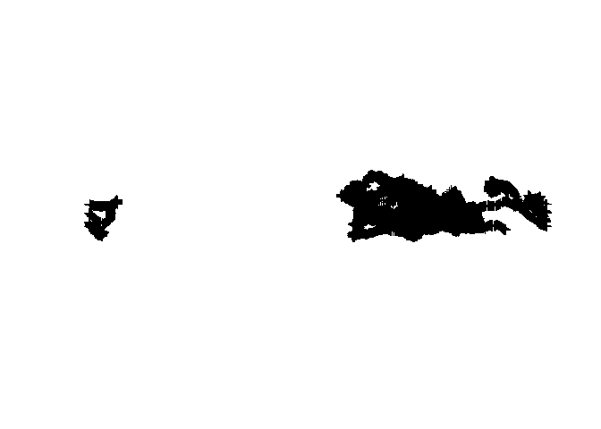<!-- -->

We may need to show some land map as reference


```r
# Import countries
countries <- readOGR(dsn = "data/ne/ne_110m_admin_0_countries", layer = "ne_110m_admin_0_countries")
```

```
## OGR data source with driver: ESRI Shapefile 
## Source: "C:\Git\spatial_data_analysis\data\ne\ne_110m_admin_0_countries", layer: "ne_110m_admin_0_countries"
## with 177 features
## It has 94 fields
## Integer64 fields read as strings:  POP_EST NE_ID
```

```r
plot(countries, col = "grey80", border = "grey80", axes = TRUE)
plot(mirounga, pch = 20, add = TRUE)
```

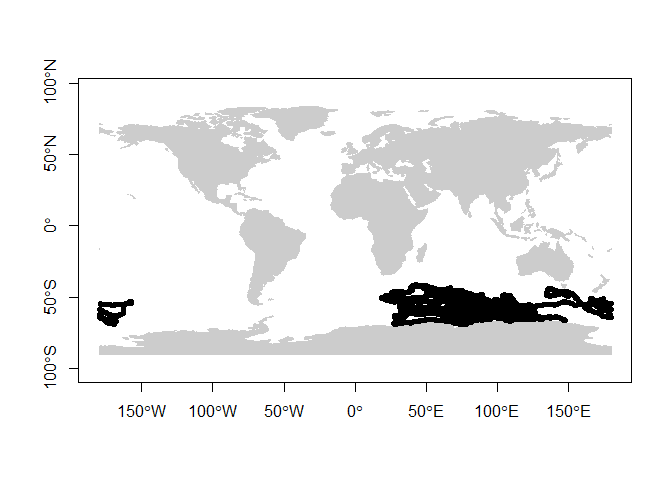<!-- -->


## Advanced maps with ggplot2

In this example we will use `ggplot2` to display the CTD data. Due to the high density, we will bin data into regular cells to summarize the observations. Finally, we will also explore how to change the CRS of the plot into a polar projection.


```r
# load library
library(ggplot2)
library(viridis)

# Import a new world dataset
# country layer have some issues using orthographic projection
world <- map_data("world")  # turn data from the maps package in to a data frame suitable for plotting with ggplot2

# Also turn back the CTD dataset into a data.frame
mirounga_df <- data.frame(mirounga)

# Plot
ggplot() + 
  geom_bin2d(data = mirounga_df, aes(x = lon, y = lat), bins = 100) +
  geom_path(data = world, aes(x = long, y = lat, group = group), colour = "#c0c0c0") +
  ylim(-90, -30) +
  xlab("") + 
  ylab("") +
  coord_map("ortho", orientation = c(-90, 0, 0)) + # orthographic projection from South Pole
  scale_fill_viridis(option = "viridis", trans = "log") + # log scale for bin count
  theme(panel.background = element_rect("white"), # dark background
        axis.ticks = element_blank(),
        panel.grid = element_blank(), # remove panel grid
        axis.text = element_blank()) # remove x-axis value
```

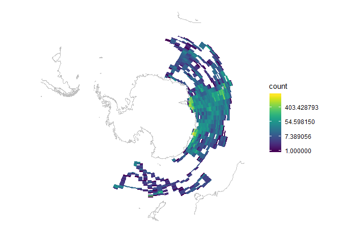<!-- -->


## Movement trajectory data


```r
# Select one tag
track <- mirounga[mirounga$tag == "ct77-167-12",]
plot(track, axes = TRUE)
plot(countries, col = "grey80", border = "grey80", add=TRUE)
```

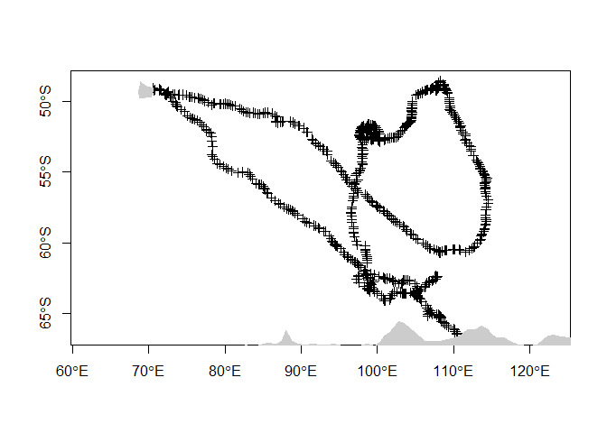<!-- -->


## Convex hull polygon


```r
# Calculate convex hull polygon
library(adehabitatHR)
hull <- mcp(track, percent = 100)
plot(hull, col = "lightblue")
plot(track,add=TRUE)
plot(countries, col = "grey80", border = "grey80", add=TRUE)
```

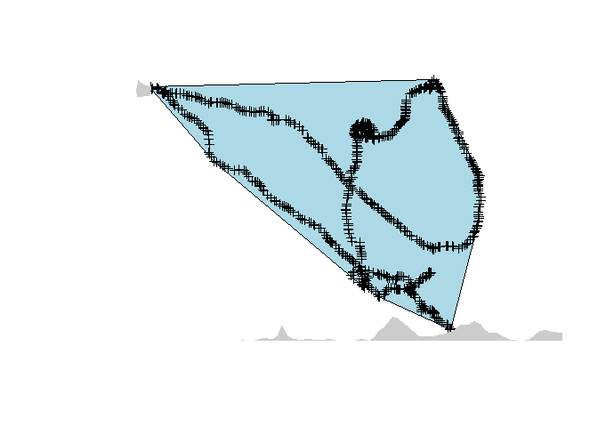<!-- -->


## Export new objects

Finally, we will export this new `sp` objects into a shapefile in order to be imported into a GIS software like QGIS


```r
# Export to Shapefile
writeOGR(track, dsn = "data/meop", layer = "track_points", driver = "ESRI Shapefile", overwrite_layer = TRUE)
writeOGR(hull, dsn = "data/meop", layer = "track_hull", driver = "ESRI Shapefile", overwrite_layer = TRUE)

# Export to KML
writeOGR(track, dsn = "data/meop/track_points.kml", layer = "track", driver = "KML", overwrite_layer = TRUE)
writeOGR(hull, dsn = "data/meop/track_hull.kml", layer = "hull", driver = "ESRI Shapefile", overwrite_layer = TRUE)
```


## Animated plots for movement data


```r
# Import libraries
library(lubridate)  # parse times
library(move)  # move object class and tools for trajectories
library(moveVis)  # animation plots
```


First, we will convert the trajectory data into a move object


```r
# Back transform SpatialPointsDataFrame into a data.frame
track <- as.data.frame(track)

# parse date time
track$date <- parse_date_time(track$date, "Ymd HMS")

# convert to move object
mdata <- move(x=track$lon, y=track$lat, time=track$date, 
                  data=track, proj=CRS("+proj=longlat +ellps=WGS84"), 
                  animal=track$tag)
```

Trajectories from animals or human can be recorded at irregular sampling intervals. To explore data using animations, we need to generated unique time frames. Therefore, we have to interpolate the trajectory at regular time intervals.


```r
# align move_data to a uniform time scale
# For animation, unique frame times are needed 
m <- align_move(mdata, res = 1, digit = 0, unit = "days", spaceMethod = "greatcircle")
```

Next step is to create individuals frames for each time step


```r
# create spatial frames with a OpenStreetMap watercolour map
frames <- frames_spatial(m,  # move object
                         map_service = "carto", map_type = "voyager_no_labels",  # base map
                         path_size = 2, path_colours = c("orange"), alpha = 0.5) %>%  # path
          add_labels(x = "Longitude", y = "Latitude") %>% # add some customizations
          add_northarrow(colour = "black", position = "bottomright") %>% 
          add_scalebar(colour = "black", position = "bottomleft") %>% 
          add_timestamps(m, type = "label") %>% 
          add_progress(size = 2)
```

```
## Processing movement data...
## Approximated animation duration: ˜ 9.12s at 25 fps for 228 frames
## Retrieving and compositing basemap imagery...
## Assigning raster maps to frames...
## Creating frames...
```

We can preview one of the created frames


```r
frames[[100]] # preview one of the frames, e.g. the 100th frame
```

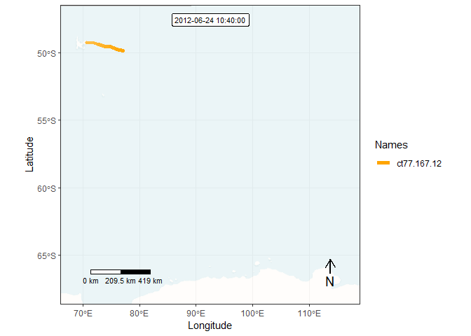<!-- -->

Finally, we can generate an animation by combining all individual frames. This function takes a while...


```r
# animate frames
# animate_frames(frames, out_file = "img/animation.gif", overwrite = TRUE, display = FALSE)
```

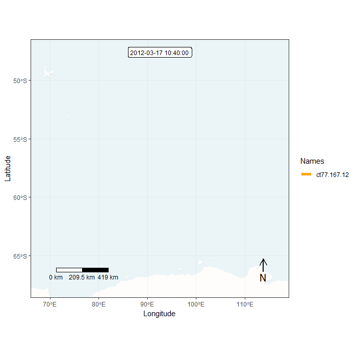


### Extra bonus

We will combine our previous knowledge to transform data into a polar projection. And will use a custom base maps in raster format.


```r
# transform trajectory to the polar stereographic projection (EPSG:3031)
mpol <- spTransform(m, crs("+init=epsg:3031"))

# import base map
bmap <- brick("data/ne/NE1_50M_SR_W/NE1_50M_SR_W.tif")

# plot base map raster
plot(bmap)
```

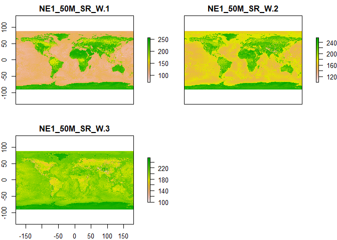<!-- -->

```r
# compose the 3 RGB bands of Tif file
plotRGB(bmap)
```

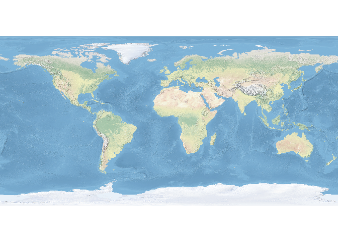<!-- -->

```r
# crop basedmap to extent of track (plus 2 degrees)
bmap <- crop(bmap, extent(-180, 180, -90, -40))

# reproject raster to polar stereographic projection (EPSG:3031)
bmap_pol <- projectRaster(bmap, crs = crs("+init=epsg:3031"))

# plot data
plotRGB(bmap_pol, addfun = lines(mpol))
```

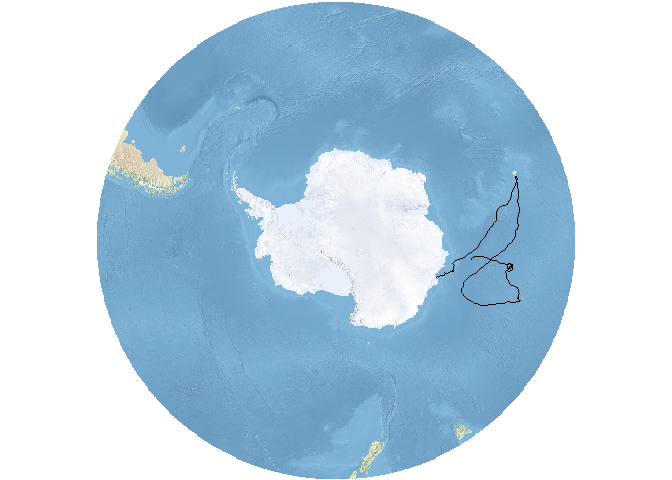<!-- -->

Prepare individual frames for animation. Note this time there are several differences in the code


```r
# create spatial frames with a OpenStreetMap watercolour map
frames <- frames_spatial(mpol,
          r_list = bmap_pol, r_times = m$time[1], ext = extent(bmap_pol),  #custom base map
          path_size = 2, path_colours = c("orange"), alpha = 0.5) %>% 
          add_timestamps(mpol, type = "label") %>% 
          add_progress(size = 2)
```

```
## Processing movement data...
## Approximated animation duration: ˜ 9.12s at 25 fps for 228 frames
## Assigning raster maps to frames...
## Creating frames...
```

```r
frames[[100]] # preview one of the frames, e.g. the 100th frame
```

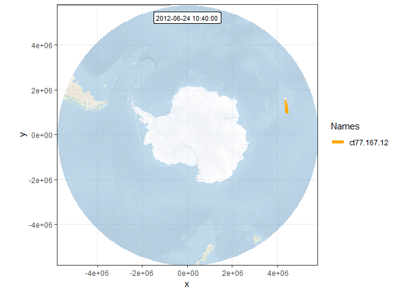<!-- -->


This time, we will remove the axis labels


```r
# remove axis
frames <- add_gg(frames, gg = expr(theme(axis.ticks = element_blank(),
                                         axis.title = element_blank(),
                                         axis.text = element_blank())))

frames[[100]] # preview one of the frames, e.g. the 100th frame
```

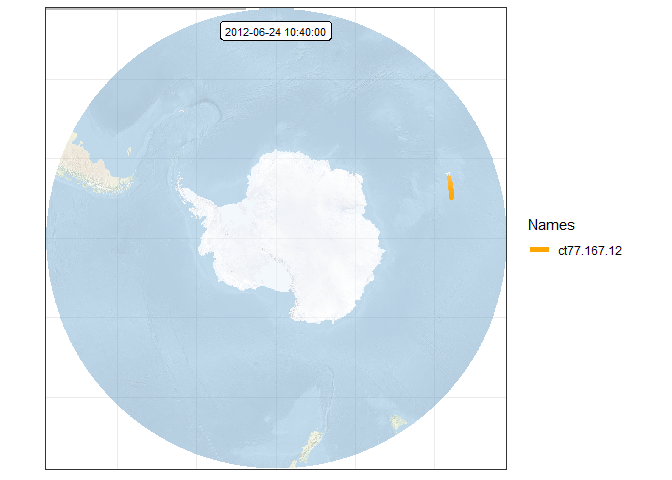<!-- -->


Finally, we can generate an animation by combining all individual frames. This function takes a while...


```r
# animate frames
# animate_frames(frames, out_file = "img/animation_polar.gif", overwrite = TRUE, display = FALSE)
```
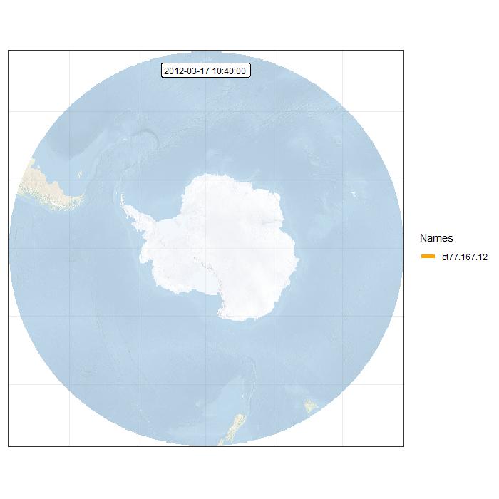


## Retrieve animal observations using R client for APIs

Several public online databases offer the posibility to extract their information using an application programming interface (API). An API is a set of routines, protocols, and tools for building software applications. There are some R packages that allow the connection to those APIs in order to retrieve information.

Here, we show the use of one client for the Ocean Biogeographic Information System that allow us to extract species occurrence records.


```r
# load library
library(robis)

# import data
# records <- occurrence("Physeter macrocephalus")  # Scientific name of the sperm whale. You can replace it with your favourite one!
```


<!--chapter:end:ch_vector_oceanographers.Rmd-->

